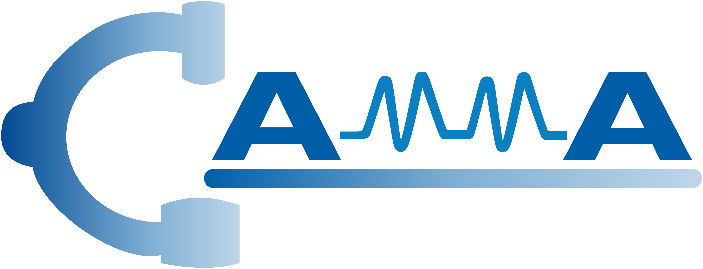
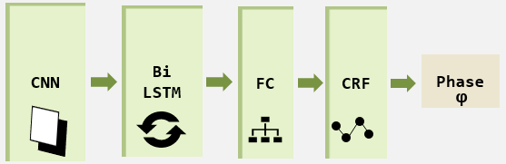

<div align="center">
<a href="http://camma.u-strasbg.fr/">

</a>
</div>

# Deep Temporal Model for Surgical Phase Recognition

Demo notebook for laparoscopic cholecystectomy phase recognition using a CNN-biLSTM-CRF.
-------------------
**Learning from a tiny dataset of manual annotations: a teacher/student approach for surgical phase recognition (IPCAI 2019)**

[](https://arxiv.org/abs/1812.00033)
[](https://colab.research.google.com/drive/1UwWwA-HlGJUrLI_e9C0sZAjVBMRF1aKW?usp=sharing)

_Tong Yu, Didier Mutter, Jacques Marescaux, Nicolas Padoy_

## Description

Laparoscopic cholecystectomy is a surgical procedure for removing a patient's gallbladder. As a minimally invasive procedure it is video-monitored via endoscopic cameras.

Our algorithm analyzes the video recordings from those cameras to automatically identify the **7 surgical phases** making up the procedure:

- Preparation
- Calot triangle dissection
- Clipping and cutting
- Gallbladder dissection
- Gallbladder retraction
- Cleaning and coagulation
- Gallbladder packaging

The underlying deep neural network is a stack of:

- Resnet-50
- Bidirectional LSTM
- Linear-chain CRF



Training was performed on 80 videos from *cholec120*, a superset of the publicly released *cholec80* dataset available [here](http://camma.u-strasbg.fr/datasets).

On a test set of 30 videos from *cholec120*, accuracy reaches **89.5%**. Average F1 score over all 7 phases reaches **82.5%**.

## Requirements

- Python 3
- Tensorflow 1.14
- numpy
- opencv 3.4
- matplotlib
- ruamel_yaml

## Citation
```bibtex
@inproceedings{yu2019surgicalphase,
title = {Learning from a tiny dataset of manual annotations: a teacher/student approach for surgical phase recognition},
author = {Tong Yu, Didier Mutter, Jacques Marescaux, Nicolas Padoy},
booktitle = {International Conference on Information Processing in Computer-Assisted Interventions},
year = {2019}
}
```

## License
This code may be used for **non-commercial scientific research purposes** as defined by [Creative Commons 4.0](https://creativecommons.org/licenses/by-nc-sa/4.0/legalcode). By downloading and using this code you agree to the terms in the [LICENSE](LICENSE). Third-party codes are subject to their respective licenses.
